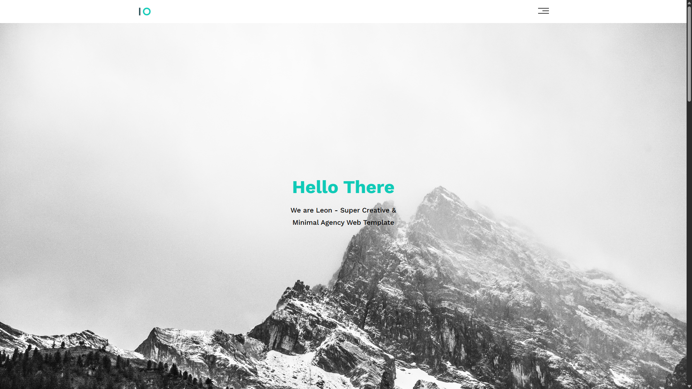

# 🌐 Leon Template One

A simple and clean HTML & CSS template built with **HTML5** and **CSS3**.  
This project features a modern, responsive design suitable for personal portfolios or landing pages.

---

## 🚀 Live Demo

📍 [View Live](https://abd-el-rahman-adel-dev.github.io/HTML-CSS_First_project/)

---

## 📸 Screenshot

 <!-- Add your actual screenshot if available -->
<!-- Add more screenshots here if you want -->

---

## ✨ Features

- 📱 Fully responsive design  
- 🎨 Clean and minimalist layout  
- 🧭 Smooth scrolling navigation  
- 📄 Multi-section landing page  
- ⚡ Lightweight and fast loading

---

## 🛠 Tech Stack

- **HTML5**  
- **CSS3**

> 💡 No JavaScript – pure HTML and CSS

---

## 📦 Getting Started

To run the project locally:

```bash
git clone https://github.com/abd-el-rahman-adel-dev/HTML-CSS_First_project.git
cd HTML-CSS_First_project
open index.html
```

Or just double-click `index.html` in your file manager.

---

## 📁 Project Structure

```
📦 HTML-CSS_First_project
┣ 📂 css
┃ ┗ 📜 style.css
┣ 📂 images
┣ 📜 index.html

```

---

## 📄 License

This project is licensed under the [MIT License](./LICENSE).

---

## 🙋‍♂️ Author

- [Abd El-Rahman Adel](https://github.com/abd-el-rahman-adel-dev)
- [LinkedIn](https://www.linkedin.com/in/abdelrahman-adel-webdev)

---

> ⭐ If you like this project, please consider starring the repo!
